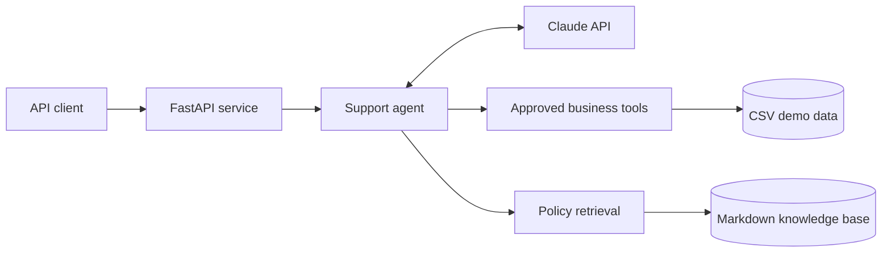

# Trailhead Customer Support API

[](https://github.com/Mini34/trailhead-claude-support-api/actions/workflows/ci.yml)

[](LICENSE)

A grounded customer-support bot for the fictional Trailhead Supply Co. It runs on your
Anthropic API key, uses Claude for conversation and tool selection, and keeps order
authorization, discount math, return deadlines, and warranty routing in deterministic
Python code.

The sample business includes 20 products, 20 customers, 40 orders, recent shipments,
inventory, support cases, three verified-affiliation discount programs, and 12
policy/playbook documents.

## Engineering highlights

- **Grounded responses:** Claude can search a controlled policy library and returns the
  source filenames used in each answer.
- **Deterministic business rules:** order ownership, discounts, return eligibility, and
  escalation decisions stay in tested Python code rather than model-generated logic.
- **Safe demo boundary:** the service is read-only and clearly distinguishes a request
  from a completed cancellation, refund, or investigation.
- **Observable API:** responses expose request IDs, tool usage, citations, escalation
  details, model information, and token counts.
- **Automated quality checks:** the test suite and Ruff run on every push and pull
  request across supported Python versions.

## Architecture



The model handles conversation and tool selection. The application owns authorization,
business calculations, escalation rules, and the final structured response contract.

## What it handles

- Verified order status, tracking, recent orders, and existing support cases
- Exact arrival timing relative to today, overdue detection, status explanations, and
  delivery next steps
- Processing-order cancellations without falsely claiming the action was completed
- Returns, Trail Club 60-day windows, footwear condition, and Final Sale rules
- Warranty routing for manufacturing defects, including Final Sale items
- STUDENT15, EDUCATOR10, and RESPONDER10 verification, expiration, cooldown, product
  exclusions, stacking rules, and exact discount calculations
- Product search, inventory, shipping, price matching, exchanges, gear care, and FAQs
- Deterministic escalation for billing, safety, fraud, privacy, and human requests
- Inline policy citations plus machine-readable `sources`, `tools_used`, `escalation`,
  and token `usage` fields

## Run locally on Windows

Use Python 3.11 or newer.

```powershell
py -3.12 -m venv .venv
.\.venv\Scripts\Activate.ps1
python -m pip install -e ".[dev]"
Copy-Item .env.example .env
```

Edit `.env` and replace `your_anthropic_api_key_here` with your key. Never commit the
`.env` file.

```powershell
.\scripts\run.ps1
```

Open [http://127.0.0.1:8000/docs](http://127.0.0.1:8000/docs) for the interactive API
documentation. `GET /health` reports whether Claude is configured.

## Chat request

```powershell
$body = @{
  customer_email = "sofia.nguyen@example.com"
  message = "Can I use STUDENT15 on the Trailrunner Low Shoes?"
  response_detail = "comprehensive"
} | ConvertTo-Json

Invoke-RestMethod `
  -Method Post `
  -Uri "http://127.0.0.1:8000/v1/support/chat" `
  -ContentType "application/json" `
  -Body $body
```

If you set `SUPPORT_API_KEY`, add an `X-Support-API-Key` header to chat requests.

Example response shape:

```json
{
  "request_id": "b546b96f-6eaa-42d4-b0fb-af1863de44d8",
  "answer": "Your verification is current...",
  "sources": ["discount_policy.md"],
  "tools_used": ["check_discount_eligibility"],
  "escalation": {
    "required": false,
    "category": null,
    "priority": null,
    "reason": null
  },
  "model": "claude-sonnet-5",
  "usage": {
    "input_tokens": 1800,
    "output_tokens": 210
  }
}
```

## API surface

| Endpoint | Purpose |
| --- | --- |
| `GET /health` | Report service health and whether Claude is configured |
| `GET /v1/demo/scenarios` | Return ready-to-run fictional support cases |
| `POST /v1/support/chat` | Answer a grounded customer-support request |

## Demo scenarios

`GET /v1/demo/scenarios` returns ready-to-run cases. Useful examples:

- `ava.bennett@example.com`: verified student still in a 30-day cooldown
- `sofia.nguyen@example.com`, order `1033`: eligible Trail Club footwear return
- `liam.carter@example.com`, order `1032`: Processing cancellation request
- `ethan.park@example.com`, order `1036`: Final Sale tent defect routed to warranty
- `mia.thompson@example.com`, order `1035`: delivered-but-missing investigation
- `daniel.kim@example.com`, order `1040`: duplicate-charge escalation

These emails are fictional test identities. The reference date for the case studies is
July 23, 2026; live return calculations use the server's current date.

`response_detail` accepts `concise`, `standard`, or `comprehensive`. Comprehensive is
the default and returns the direct answer, verified facts, status or policy meaning,
exact timing or amounts, next steps, and relevant limitations.

## Test

```powershell
python -m pytest
ruff check .
```

Tests mock Claude and do not consume API credits.

## Architecture and safety

Claude receives a small set of approved tools. Customer ownership checks run inside the
server, not in the model. The `customer_email` field is a demonstration stand-in for
authentication; production should derive a customer ID from a signed session or JWT.

The API is intentionally read-only. It cannot actually cancel an order, issue a refund,
create a label, or open an investigation. Connect those actions to your order system
only after adding idempotency, permission checks, audit logs, and explicit success
responses.

Policies live in `knowledge/`; business records live in `data/`. Update both when a
business rule changes, then add a regression test for the change. The retriever labels
case studies as illustrative so they cannot silently override policy.

The implementation follows Anthropic's current
[Python SDK](https://platform.claude.com/docs/en/cli-sdks-libraries/sdks/python) and
[client-tool lifecycle](https://platform.claude.com/docs/en/agents-and-tools/tool-use/handle-tool-calls).

## License

Licensed under the [BSD 3-Clause License](LICENSE).
